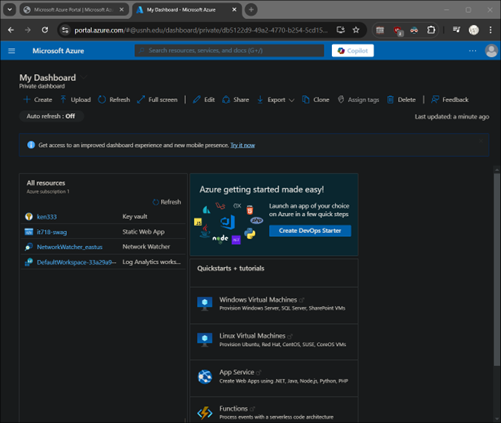
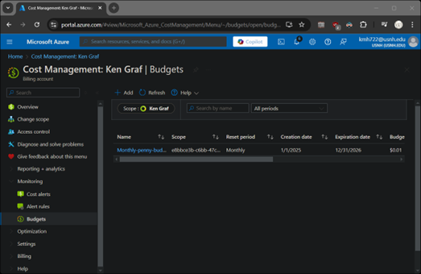

# Azure										
1.  Create an account on Azure, if needed.  [LINK](https://azure.microsoft.com/en-us/pricing/purchase-options/azure-account)
2.	Azure provides a $200 credit for your first 30 days, and some limited services free for 12 months.
3.	Login to the console. It is HIGHLY RECOMMENDED that you enable MFA.  Provide a screenshot in your lab report showing the portal dashboard, it should look similar to this:

4.	Use of the published Azure consumption budget CLI is only for enterprise agreements, and does not support daily budgets.
5.	In the portal search for budget and create a new budget.  Submit a screenshot of the new budget:

