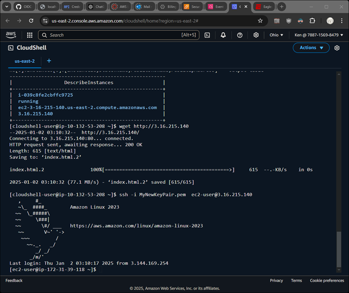

# AWS												
1.	Use the command shell to deploy a server running nginx.
2.	Retrieve IP address of new instance.
3.	Verify running web page and ssh connectivity.

### Variables (Replace with your values)
```
KEY_NAME="MyNewKeyPair"
SECURITY_GROUP_NAME="MySecurityGroup"
DESCRIPTION="Security group open to the world for SSH & HTTP"
INSTANCE_TYPE="t2.micro"
```
### Get the default VPC and subnet
```
VPC_ID=$(aws ec2 describe-vpcs --query 'Vpcs[?IsDefault==`true`].VpcId' --output text)
SUBNET_ID=$(aws ec2 describe-subnets --filters "Name=default-for-az,Values=true" --query 'Subnets[0].SubnetId' --output text)
```
### Create a new key pair
```
echo "Creating key pair: $KEY_NAME..."
aws ec2 create-key-pair --key-name $KEY_NAME --query 'KeyMaterial' --output text > ${KEY_NAME}.pem
chmod 400 ${KEY_NAME}.pem
```
### Create a new security group
```
echo "Creating security group: $SECURITY_GROUP_NAME..."
SG_ID=$(aws ec2 create-security-group --group-name $SECURITY_GROUP_NAME --description "$DESCRIPTION" --vpc-id $VPC_ID --query 'GroupId' --output text)
```
### Authorize inbound SSH & HTTP traffic
```
echo "Authorizing inbound traffic on port 22 & 80..."
aws ec2 authorize-security-group-ingress --group-id $SG_ID --protocol tcp --port 80 --cidr 0.0.0.0/0
aws ec2 authorize-security-group-ingress --group-id $SG_ID --protocol tcp --port 22 --cidr 0.0.0.0/0
```
### Launch a new instance
```
echo "Launching EC2 instance..."
INSTANCE_ID=$(aws ec2 run-instances \
  --image-id resolve:ssm:/aws/service/ami-amazon-linux-latest/al2023-ami-kernel-default-x86_64 \
  --instance-type $INSTANCE_TYPE \
  --key-name $KEY_NAME \
  --security-group-ids $SG_ID \
  --subnet-id $SUBNET_ID \
--tag-specifications 'ResourceType=instance,Tags=[{Key=Name,Value=Nginx}]' \
 --user-data '#!/bin/bash
yum update -y
yum install nginx -y
systemctl start nginx
systemctl enable nginx' \
  --query 'Instances[0].InstanceId' --output text)
```
### Retrieve IP address
```
aws ec2 describe-instances --instance-ids $INSTANCE_ID --query 'Reservations[0].Instances[0].[InstanceId,State.Name,PublicDnsName,PublicIpAddress]' --output table
```
### clean up (not scripted)
Terminate ec2
Delete keypair & security-group
Delete MyNewKeyPair.pem

# Lab report
Submit screenshot showing 'wget' retrieving nginx default page and SSH login

