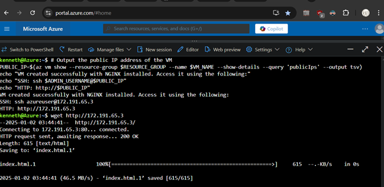
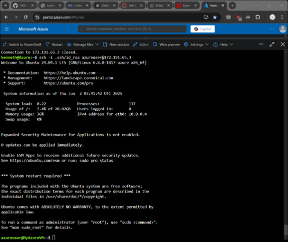

# Azure												
1.	Use the command shell to deploy a server running nginx.
2.	Retrieve IP address of new instance.
3.	Verify running web page and ssh connectivity.

### Variables (Replace with your values)
```
RESOURCE_GROUP="MyResourceGroup"
LOCATION="eastus"
VM_NAME="MyAzureVM"
IMAGE="Ubuntu2404"
VM_SIZE="Standard_B1s"
ADMIN_USERNAME="azureuser"
SSH_KEY_PATH="$HOME/.ssh/id_rsa.pub"
NSG_NAME="MyNSG"
VNET_NAME="MyVNet"
SUBNET_NAME="MySubnet"
IP_NAME="MyPublicIP"
NIC_NAME="MyNIC"
CUSTOM_DATA_FILE="cloud-init-nginx.txt"
```
### Check if SSH key exists (create if not)
```
if [ ! -f "$SSH_KEY_PATH" ]; then
  echo "SSH key not found at $SSH_KEY_PATH. Generating a new one..."
  ssh-keygen -t rsa -b 2048 -f "$HOME/.ssh/id_rsa" -q -N ""
  echo "New SSH key generated."
fi
```
### Create a resource group
```
az group create --name $RESOURCE_GROUP --location $LOCATION
```
### Create a virtual network
```
az network vnet create \
  --resource-group $RESOURCE_GROUP \
  --name $VNET_NAME \
  --address-prefix 10.0.0.0/16 \
  --subnet-name $SUBNET_NAME \
  --subnet-prefix 10.0.0.0/24
```
### Create a network security group (NSG)
```
az network nsg create \
  --resource-group $RESOURCE_GROUP \
  --name $NSG_NAME
```
### Add a rule to allow HTTP (port 80)
```
az network nsg rule create \
  --resource-group $RESOURCE_GROUP \
  --nsg-name $NSG_NAME \
  --name AllowHTTP \
  --protocol tcp \
  --priority 1001 \
  --destination-port-ranges 80 \
  --access Allow
```
### Add a rule to allow SSH (port 22)
```
az network nsg rule create \
  --resource-group $RESOURCE_GROUP \
  --nsg-name $NSG_NAME \
  --name AllowSSH \
  --protocol tcp \
  --priority 1000 \
  --destination-port-ranges 22 \
  --access Allow
```
### Create a public IP address
```
az network public-ip create \
  --resource-group $RESOURCE_GROUP \
  --name $IP_NAME \
  --sku Basic
```
### Create a network interface card (NIC)
```
az network nic create \
  --resource-group $RESOURCE_GROUP \
  --name $NIC_NAME \
  --vnet-name $VNET_NAME \
  --subnet $SUBNET_NAME \
  --network-security-group $NSG_NAME \
  --public-ip-address $IP_NAME
```
### Create the virtual machine with cloud-init for NGINX
```
az vm create \
  --resource-group $RESOURCE_GROUP \
  --name $VM_NAME \
  --image $IMAGE \
  --size $VM_SIZE \
  --admin-username $ADMIN_USERNAME \
  --ssh-key-values $SSH_KEY_PATH \
  --nics $NIC_NAME \
  --custom-data cloud-init-nginx.txt
```

### Output connection information
```
PUBLIC_IP=$(az vm show --resource-group $RESOURCE_GROUP --name $VM_NAME --show-details --query 'publicIps' --output tsv)
echo "SSH: ssh $ADMIN_USERNAME@$PUBLIC_IP"
echo "HTTP: http://$PUBLIC_IP"
```
# Lab Report
Show retirieving the ngnix default page and SSH login:


