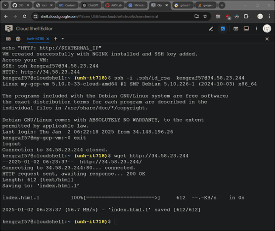

# GCP												
1.	Use the command shell to deploy a server running nginx.
2.	Retrieve IP address of new instance.
3.	Verify running web page and ssh connectivity.

### Variables (Replace with your values)
```
PROJECT_ID="my-gcp-project"  # Replace with your GCP project ID
ZONE="us-central1-a"  # Replace with your desired zone
VM_NAME="my-gcp-vm"
MACHINE_TYPE="e2-micro"  # VM type
IMAGE_FAMILY="debian-11"  # Use a Debian image family
IMAGE_PROJECT="debian-cloud"  # Debian image project
FIREWALL_NAME="allow-http-ssh"
NETWORK="default"
STARTUP_SCRIPT="startup-nginx.sh"
SSH_KEY_PATH="$HOME/.ssh/id_rsa.pub"  # Path to your public SSH key
METADATA_FILE="ssh-keys-metadata.txt"
```
### Ensure gcloud CLI is authenticated
```
gcloud auth login --quiet
```
### Set the active project
```
gcloud config set project $PROJECT_ID
```
### Check if SSH key exists, generate if necessary
```
if [ ! -f "$SSH_KEY_PATH" ]; then
  echo "SSH key not found at $SSH_KEY_PATH. Generating a new one..."
  ssh-keygen -t rsa -b 2048 -f "$HOME/.ssh/id_rsa" -q -N ""
  echo "New SSH key generated."
fi
```
### Get the username from the SSH key file
```
SSH_USERNAME=$(whoami)
PUBLIC_KEY=$(cat $SSH_KEY_PATH)
SSH_KEY_METADATA="${SSH_USERNAME}:$PUBLIC_KEY"
```
### Write SSH key metadata to file
```
echo $SSH_KEY_METADATA > $METADATA_FILE
```
### Create a firewall rule for HTTP (port 80) and SSH (port 22)
```
gcloud compute firewall-rules create $FIREWALL_NAME \
  --direction=INGRESS \
  --priority=1000 \
  --network=$NETWORK \
  --action=ALLOW \
  --rules=tcp:22,tcp:80 \
  --source-ranges=0.0.0.0/0
```
### Create the virtual machine
```
gcloud compute instances create $VM_NAME \
  --zone=$ZONE \
  --machine-type=$MACHINE_TYPE \
  --image-family=$IMAGE_FAMILY \
  --image-project=$IMAGE_PROJECT \
  --network=$NETWORK \
  --tags=http-server,https-server \
  --metadata-from-file=ssh-keys=$METADATA_FILE \
 --metadata-from-file startup-script=init-script.sh
```
### Get the external IP address of the VM
```
EXTERNAL_IP=$(gcloud compute instances describe $VM_NAME --zone=$ZONE --format='get(networkInterfaces[0].accessConfigs[0].natIP)')
echo "VM created successfully with NGINX installed and SSH key added."
echo "Access your VM:"
echo "SSH: ssh $SSH_USERNAME@$EXTERNAL_IP"
echo "HTTP: http://$EXTERNAL_IP"
```
# Lab Report
Show retrieving the default nginx page and ssh login

