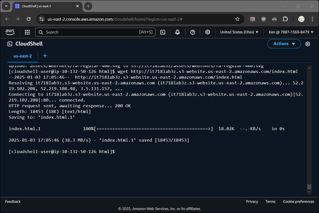
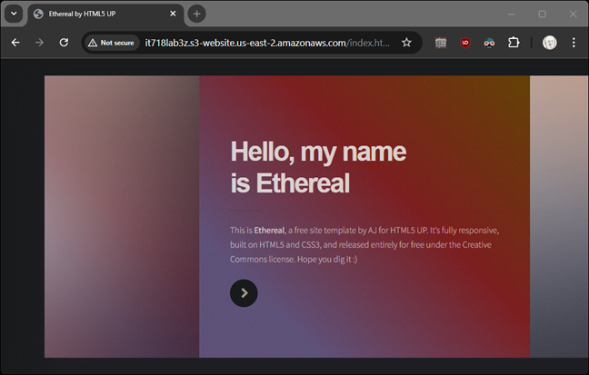

# AWS												
1.	Identify static web site you would like to publish on the web.
2.	Push the web content to cloud storage.
3.	Make the cloud storage publicly available.

### Set up your environment:
```
mkdir html
cd html
wget -O html.zip <your source>
unzip html.zip

YOUR_BUCKET_NAME=<your-globally-unique-name>
REGION=us-east-2
SOURCE_PATH=./
```
At a minimum you should have an index.html filein your current directory.

### Create bucket
```
aws s3api create-bucket \
    --bucket $YOUR_BUCKET_NAME \
    --region $REGION \
    --create-bucket-configuration LocationConstraint=$REGION
```
### Allow public access
```
aws s3api put-bucket-ownership-controls \
    --bucket $YOUR_BUCKET_NAME \
    --ownership-controls 'Rules=[{ObjectOwnership=ObjectWriter}]'

aws s3api put-public-access-block \
  --bucket $YOUR_BUCKET_NAME \
  --public-access-block-configuration   "BlockPublicAcls=false,IgnorePublicAcls=false,BlockPublicPolicy=false,RestrictPublicBuckets=false"

aws s3api put-bucket-website --bucket $YOUR_BUCKET_NAME --website-configuration '{
    "IndexDocument": { "Suffix": "index.html"},
    "ErrorDocument": { "Key": "error.html" }
}'
```
### Set AWS service access policy
Use the policy.json in this directory. Replace the $YOUR_BUCKET_NAME placeholder with you bucket.
```
aws s3api put-bucket-policy --bucket $YOUR_BUCKET_NAME --policy file://policy.json
```
### Upload content from current directory
```
aws s3 sync ./ s3://$YOUR_BUCKET_NAME/
```
### Retrieve website home page for lab report
```
wget http://$YOUR_BUCKET_NAME.s3-website.$REGION.amazonaws.com
```
# Lab Report
Sample screenshots


