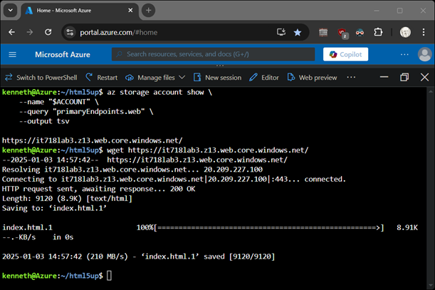
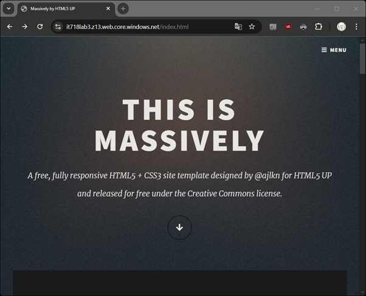

# AZURE										
1.	Identify static web site you would like to publish on the web.
2.	Push the web content to cloud storage.
3.	Make the cloud storage publicly available.

### Set up your environment:
```
mkdir html
cd html
wget -O html.zip <your source>
unzip html.zip

ACCOUNT=it718lab3
RESOURCE_GROUP=it718lab3
REGION=eastus
```
### Create a resource group
```
az group create --name $RESOURCE_GROUP --location $REGION
```
### Create a storage account
```
az storage account create \
    --name "$ACCOUNT" \
    --resource-group $RESOURCE_GROUP \
    --location $REGION \
    --sku Standard_LRS
```
### Enable the storage account as a website
```
az storage blob service-properties update \
    --account-name "$ACCOUNT" \
    --static-website \
    --index-document index.html
```
### Move your content to the cloud
```
az storage blob upload-batch \
    --account-name "$ACCOUNT" \
    --destination '$web' \
    --source ./
```
### Retrieve the URL
```
az storage account show \
    --name "$ACCOUNT" \
    --query "primaryEndpoints.web" \
    --output tsv
```
### Sample screenshots


