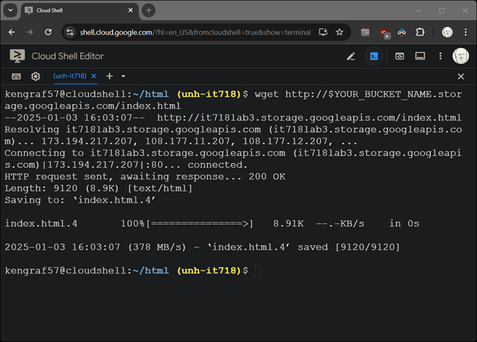
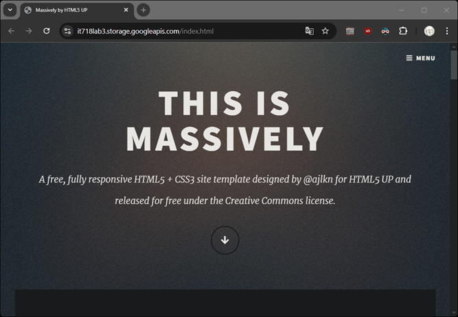

# GCP											
1.	Identify static web site you would like to publish on the web.
2.	Push the web content to cloud storage.
3.	Make the cloud storage publicly available.

### Set up your environment:
```
gcloud config set project <your-project>
mkdir html
cd html
wget -O html.zip <your source>
unzip html.zip

YOUR_BUCKET_NAME=it718lab3
```
### Create bucket
```
gcloud storage buckets create gs://$YOUR_BUCKET_NAME \
    --location=US \
    --uniform-bucket-level-access
```
### Allow public access
```
gcloud storage buckets add-iam-policy-binding gs://$YOUR_BUCKET_NAME \
    --member="allUsers" \
    --role="roles/storage.objectViewer"
```
### Upload content from current directory
```
gcloud storage cp -r ./ gs://$YOUR_BUCKET_NAME/
```
### Define home page
```
gcloud storage buckets update gs://$YOUR_BUCKET_NAME \
    --web-main-page-suffix=index.html --web-error-page=error.html
```
### Retrieve website home page for lab report
```
wget http://$YOUR_BUCKET_NAME.storage.googleapis.com/index.html
```
# Lab Ewport
Sample screenshots


