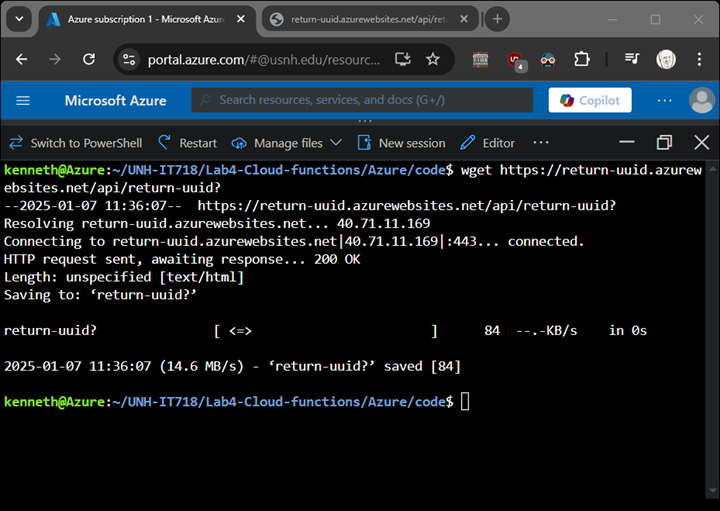
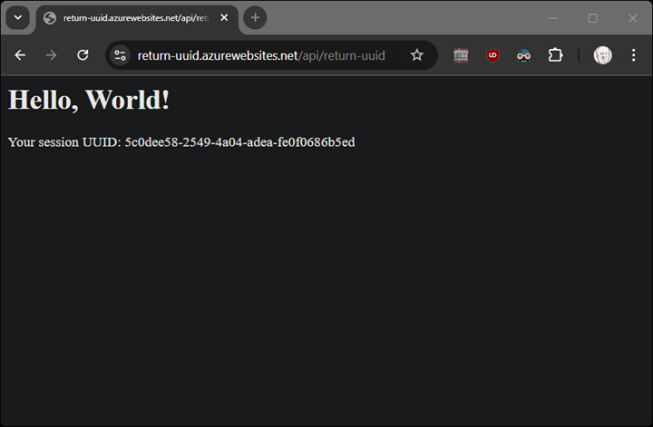

# Azure: Cloud Functions												
1.	Review package elements (sample code provided).
2.	Deploy the function.
3.	Validate execution.

> [!NOTE]
> functionapp names must be globally unique.  Thus you will need to replace "return-uuid" in the commands below, as well as renaming the "code/return-uuid" folder.  

> [!WARNING]
> As of Jan 6, 2025: "az functionapp" generates "CryptographyDeprecationWarning:" warnings.  This is a known bug and for lab purposes can be ignored.

### Set up your environment:
```
ACCOUNT=it718lab4
RESOURCE_GROUP=it718lab4
REGION=eastus
```
### Create a resource group
```
az group create --name $RESOURCE_GROUP --location $REGION
```
### Create a storage account
```
az storage account create \
    --name "$ACCOUNT" \
    --resource-group $RESOURCE_GROUP \
    --location $REGION \
    --sku Standard_LRS
```
### Create cloud function
```
az functionapp create \
    --resource-group $RESOURCE_GROUP \
    --consumption-plan-location $REGION \
    --runtime python \
    --runtime-version 3.11 \
    --functions-version 4 \
    --name return-uuid \
    --storage-account $ACCOUNT  --os-type Linux
az functionapp cors add \
    --name $APP_NAME \
    --resource-group $RESOURCE_GROUP \
    --allowed-origins "*"
```
### Create functionzip
```
cd <project-folder>
zip -r functionapp.zip .
```
### Deploy the code
```
az functionapp deployment source config-zip \
    --resource-group $RESOURCE_GROUP \
    --name return-uuid \
    --src functionapp.zip
```
## Lab report

> [!NOTE] The function needs to remain available until the lab is graded.*

The functionapp URL is https://<your-function-name>azurewebsitea.net/api/<your-function-name>?

Show screenshots of using wget from the cloud sheel and a browser fetch.  



