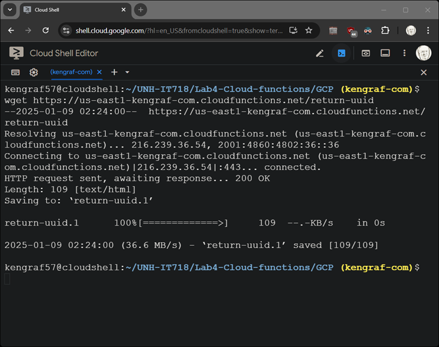
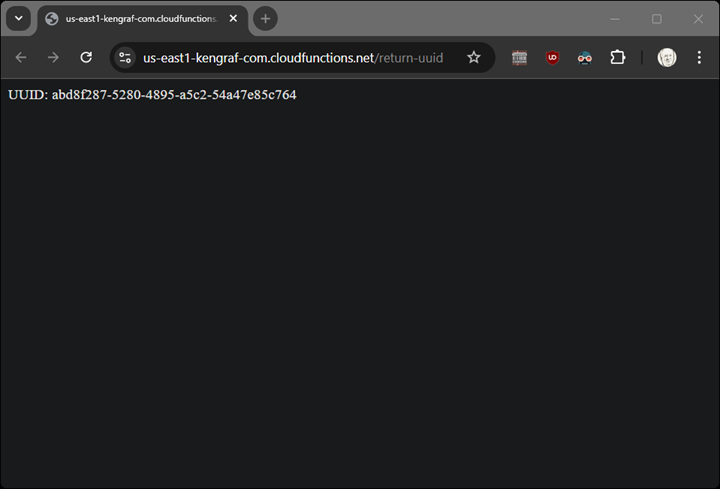

# GCP										
1.	Review package elements (sample code provided).
2.	Deploy the function.
3.	Validate execution.

### Setup environment
`PROJECT_ID="unh-it718"  # Replace with your GCP project ID`
```
REGION=us-east1
APP_NAME=return-uuid
gcloud config set project $PROJECT_ID
gcloud services enable cloudfunctions.googleapis.com
gcloud services enable cloudbuild.googleapis.com
```
### Create firestore database
```
gcloud firestore databases create --location=$REGION
```
### Deploy cloud function
```
gcloud functions deploy $APP_NAME \
    --region $REGION --gen2 \
    --runtime python312 \
    --trigger-http \
    --source . \
    --entry-point=handler \
    --allow-unauthenticated
```
### Retrieve URL
```
gcloud functions describe $APP_NAME --format="get(url)" --region $REGION
```
## Lab report
> [!NOTE]
> The function needs to remain available until the lab is graded.

The URL is: https://$REGION-$PROJECT_ID.cloudfunctions.net/$APP_NAME

Show screenshots of using wget from the cloud shell and a browser fetch.  


