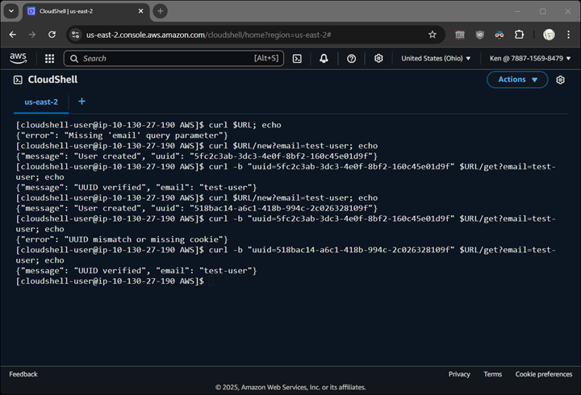

# AWS												
1.	Identify static web site you would like to publish on the web.
2.	Push the web content to cloud storage.
3.	Make the cloud storage publicly available.

### Create Database
```
DB_ARN=`aws dynamodb create-table \
    --table-name Lab5-session \
    --attribute-definitions AttributeName=email,AttributeType=S \
    --key-schema AttributeName=email,KeyType=HASH \
    --billing-mode PAY_PER_REQUEST --query "TableDescription.TableArn" --output text`
sed -i "s|YOUR_DB_ARN|${DB_ARN}|g" Lab5-dynamodb-policy.json
```
### Create an IAM Role for Lambd
```
aws iam create-role \
    --role-name Lab5-LambdaDynamoDBRole \
    --assume-role-policy-document file://Lab5-trust-policy.json
ROLE_ARN=` aws iam get-role --role-name Lab5-LambdaDynamoDBRole --query "Role.Arn" --output text`
```
### Deploy cloud function
```
zip function.zip Lab5-session.py
aws lambda create-function --function-name Lab5-session --runtime python3.13 \
    --role $ROLE_ARN --handler Lab5-session.lambda_handler --zip-file fileb://function.zip \
    --query "FunctionName" --output text
aws lambda create-function-url-config --function-name Lab5-session --auth-type NONE
aws lambda add-permission --function-name Lab5-session --action lambda:InvokeFunctionUrl \
    --principal "*" --function-url-auth-type NONE --statement-id FunctionURLPublicAccess
```
### Attach DynamoDB Permissions to the Role
```
aws iam put-role-policy \
    --role-name Lab5-LambdaDynamoDBRole \
    --policy-name Lab5-DynamoDBAccessPolicy \
    --policy-document file://Lab5-dynamodb-policy.json
```
### Attach Additional Permissions for Lambda Execution
```
aws iam attach-role-policy \
    --role-name Lab5-LambdaDynamoDBRole \
    --policy-arn arn:aws:iam::aws:policy/service-role/AWSLambdaBasicExecutionRole
```
### Attach the Role to the Lambda Function
```
aws lambda update-function-configuration \
    --function-name Lab5-session \
    --role $ROLE_ARN  --query "Role" --output text
```
### Retrieve URL for lab report
```
aws lambda get-function-url-config --function-name Lab5-session --query "FunctionUrl" --output text
```
### Lab report commands to validate deployment
The sample screenshot below shows adding a new user (twice to generate a new and old uuid).  Then testing both the new and old uuid.


