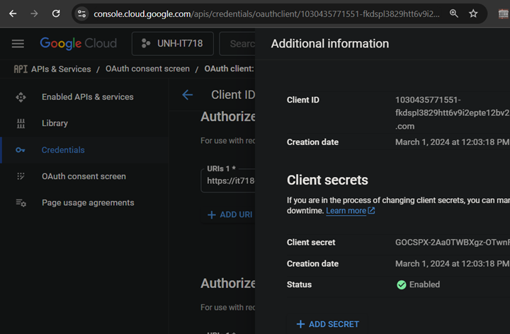

# OpenID Connect (OIDC)
Using the lessons learned in the previous labs, build out a complete serverless application.

### What the Application does
- Forces a login based on Google ID. (/index.html redirects to /login.html) 
- The OIDC JWT is sent as a POST callback to /verify_token.
- The callback is handled by a lambda function:
  - Generates a UUID
  - Stores the UUIC and OIDC provided email in DynamoDB
  - Redirects back to /index.html
- /index.html displays: OIDC JWT contents, email, and UUID values.

### Components
| CF* | Function | Purpose | Notes |  
| :---: | :---: | :--- | :--- | 
| ❌ | Github | Source (App &IoC) | Clone locally for customization
| ❌ | Google | OIDC provider | Generate client secret; set scopes
| ❌ | CloudFormation | IoC | Need to set custom values
| ✅ | S3 Bucket | Static web content & Lambda packages | Globally unique; user defined name 
| ✅ | CloudFront | CDN for static pages | 
| ✅ | Lambda | OIDC callback and session creation | 
| ✅ | DynamoDB | Storage of session UUID | 
| ✅ | API GatewayV2 | Control access to Lambda functions 
| ✅ | Route53 | Porvide friendly URL | Optional: reuiqres domain oownership 

CF*: IoC deployment based on CloudFront

## Setup (Github, Google, CloudFormation)
### Github
Clone this repo to AWS cloud shell or your local machine.
Optional: Fork this repo to allow for automated workflows and making your work public.
### Google
Follow the Google provided steps to create OAuth 2.0 Client IDs: [LINK](OIDC-connect https://developers.google.com/identity/openid-connect/openid-connect)  
__URIs:__
- The authorized Javascript origin will limit where your client ID/secret can be used.
- The redirect URL will limit where the callback can be redirect to.
- You can have multiple values: (dev, testing, and production)
- Ports matter:  http://localhost and http://localhost:8080 are not the same.

> [!IMPORTANT]
> Edit the lambda function to your client id.

> [!IMPORTANT]
> You will need to come back and adjust these settings once the CloudFront URLs are known.


You can click on the more info button (upper right) to see your client id and secret.

### CloudFormation


Prerequisites
OIDC Provider: Google
Client ID and Client Secret: Register the application with Google to obtain these credentials.
Redirect URI: Set a redirect URI (e.g., http://localhost:3000/callback).


client_id from google developer console
start with localhost, lambda domain

### Overview
CloudFront: Used to cache and serve static files (e.g., HTML, CSS, JavaScript) from an S3 bucket or another origin close to your users for low latency.  
API Gateway: Used to handle dynamic requests (e.g., POST, GET, PUT) to your backend services or AWS Lambda.
### Steps
1. Set Up an S3 Bucket for Static Content (Steps in Lab3)
2. Create a CloudFront Distribution
   - Go to the AWS CloudFront console and create a new distribution.
   - Origin Settings:
   - Origin domain: Choose your S3 bucket.
   - Behavior Settings:
   - Set Default Root Object to index.html.
   - Set allowed HTTP methods to GET, HEAD, OPTIONS (static content doesn't need POST).
   - CNAME and SSL: If you have a custom domain, configure the CNAME and attach an SSL certificate using AWS Certificate Manager (ACM).
3. Set Up API Gateway
   - Go to the AWS API Gateway console and create a new HTTP API or REST API.
   - Configure the routes:
   - Add a POST method (e.g., /submit) for dynamic requests.
   - Map it to a backend service (e.g., an AWS Lambda function, an HTTP endpoint, or a VPC link).
   - Deploy the API:
   - Create a stage (e.g., prod) and deploy the API.
   - Note the API Gateway endpoint URL.
4. Integrate Static Content and API
Example:
```
fetch('https://<api-gateway-id>.execute-api.<region>.amazonaws.com/prod/submit', {
  method: 'POST',
  headers: {
    'Content-Type': 'application/json',
  },
  body: JSON.stringify({ key: 'value' }),
})
.then(response => response.json())
.then(data => console.log(data));
```
5. Custom Domain (Optional)
To serve both static content and API under the same domain:  Use AWS Route 53 to map subdomains or paths:
Static content: Map static.example.com to the CloudFront distribution for S3.
API: Map api.example.com to the API Gateway stage.

